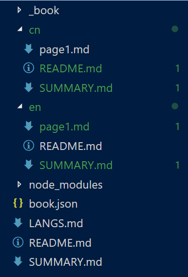

# Gitbook commands

| command | description |
| ------ | -------- |
| book sm | generate summary file |
| gitbook init | |
| gitbook serve | |
| gitbook build | generate static html files |

## Multi-language

[Multi-Lingual · GitBook Toolchain Documentation](https://toolchain.gitbook.com/languages.html)

[gitbook-plugin-language-picker - npm](https://www.npmjs.com/package/gitbook-plugin-language-picker)